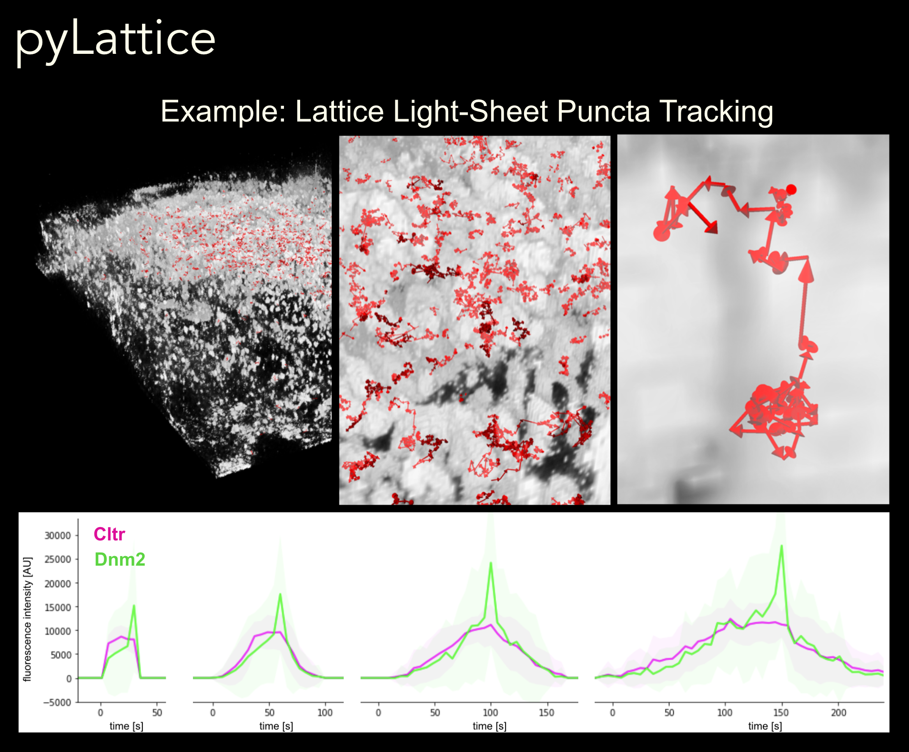

# pyLattice
A python library for advanced lattice light-sheet image analysis

Welcome!

Please read the [manual](./PyLattice_Manual.pdf) to get started.




## Installation

clone or download the repository
```bash
pip install pylattice
pip install -r requirements.txt
cd source/jupyter
jpyter notebook
```
in browser open `latticeFrame_showFrame.ipynb`

## FAQ

[Lattice Light-Sheet Microscopy](https://en.wikipedia.org/wiki/Lattice_light-sheet_microscopy)


## References

- scikit http://scikit-image.org
- ChimeraX https://www.cgl.ucsf.edu/chimerax/
- llsm tools https://github.com/francois-a/llsmtools
- utrack https://www.utsouthwestern.edu/labs/danuser/software/#utrack_ancs
- Joh Schöneberg http://www.schoeneberglab.org
- The Betzig Lab https://www.janelia.org/lab/betzig-lab
- The Drubin/Barnes Lab https://drubinbarneslab.berkeley.edu
